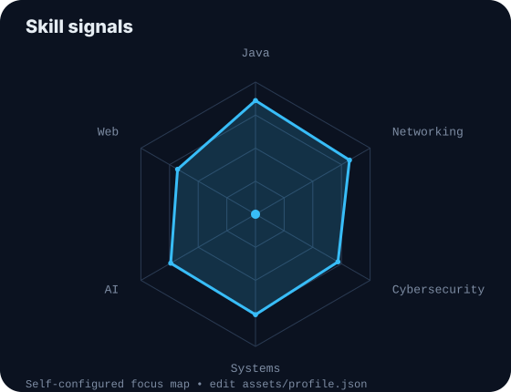
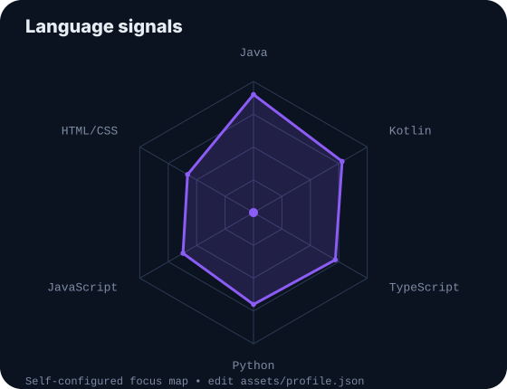
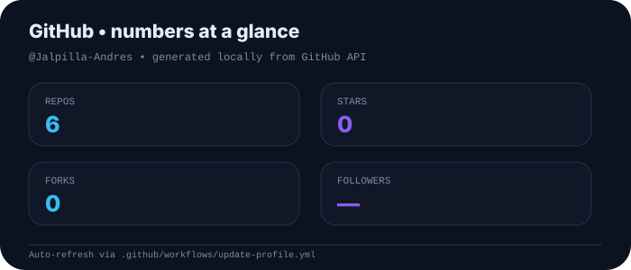
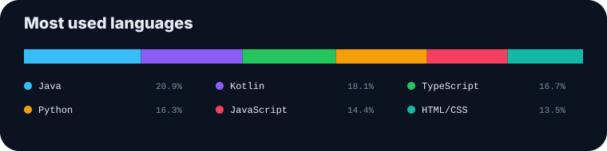

<!-- TERMINAL BANNER -->

<picture>
  <source media="(prefers-color-scheme: dark)" srcset="assets/banner-dark.svg">
  <source media="(prefers-color-scheme: light)" srcset="assets/banner-light.svg">
  
</picture>

 

<!-- TYPING HEADER -->

 

  

---

## 👨‍💻 This is me :)

Hi, I'm **Andres Jalpilla**, a **Telematics Engineer** and **Junior Developer** interested in software development, networking, systems, cybersecurity and practical AI.

I like building things that connect software, hardware and real-world problems. My portfolio is a mix of academic projects, application development, systems work and experimentation with new technologies.

* 💻 Focused on **Java** and application development.
* 🌐 Interested in **computer networking, telematics and distributed systems**.
* 🔐 Exploring **cybersecurity, infrastructure and secure systems**.
* 🤖 Interested in **Artificial Intelligence** and AI-assisted development.
* 🛠️ I enjoy projects that connect **software + hardware + engineering**.
* 🚀 Currently growing my professional portfolio and shipping new projects.

---

## ⚡ my perfect stack

---

## 📡 signals

<table>
<tr>

<td width="50%" align="center" valign="middle">

<picture>
  <source media="(prefers-color-scheme: dark)" srcset="assets/radar-dark.svg">
  <source media="(prefers-color-scheme: light)" srcset="assets/radar-light.svg">
  
</picture>

</td>

<td width="50%" align="center" valign="middle">

<picture>
  <source media="(prefers-color-scheme: dark)" srcset="assets/radar-langs-dark.svg">
  <source media="(prefers-color-scheme: light)" srcset="assets/radar-langs-light.svg">
  
</picture>

</td>

</tr>
</table>

---

## 🚀 Featured projects

| Project                                                                                               | What it is                                                    |
| ----------------------------------------------------------------------------------------------------- | ------------------------------------------------------------- |
| [**TlalocBox**](https://github.com/Jalpilla-Andres/TlalocBox)                                         | Water-quality monitoring system for storm drains or cisterns. |
| [**Sistemas-Distribuidos**](https://github.com/Jalpilla-Andres/Sistemas-Distribuidos)                 | Distributed systems project using Java.                       |
| [**ProyectoTerminal2_aplicativo2**](https://github.com/Jalpilla-Andres/ProyectoTerminal2_aplicativo2) | Kotlin application project.                                   |
| [**mi-jarvis-anelys**](https://github.com/Jalpilla-Andres/mi-jarvis-anelys)                           | Virtual assistant with tool-oriented interactions.            |

---

## 📊 Numbers matter? ohhh yes.

<picture>
  <source media="(prefers-color-scheme: dark)" srcset="assets/card-stats-dark.svg">
  <source media="(prefers-color-scheme: light)" srcset="assets/card-stats-light.svg">
  
</picture>

 

---

### 💡 Build. Learn. Repeat.

`git commit -m "keep learning, keep building"`

---
